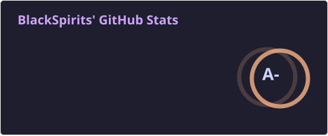
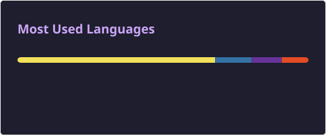

  <picture>
    <source srcset="./assets/profile-hero.svg" type="image/svg+xml" />
    
  </picture>

<h3 align="center">Born to explore. Coded to connect. 🌍</h3>

  
  
  
  
  

  

##  About Me

  Portuguese developer, open-source contributor and technology enthusiast  
🌐 European Portuguese (pt-PT) translator & reviewer with contributions across 100+ projects  
🛠️ Focused on automation, localization, media tooling and practical software  
🎬 Contributor to media, subtitles and metadata communities  
📍 From Portugal · Currently based in France  
🌍 Dreaming of exploring the world, one country at a time

👉 **[Explore my work at blackspirits.github.io](https://blackspirits.github.io)**

  

##  Localization & Review

I contribute to software localization and linguistic review in **European Portuguese (pt-PT)**, with work across **100+ open-source and software projects**.

My approach goes beyond literal translation:

- Natural and idiomatic European Portuguese
- UI and functional context
- Consistent terminology
- pt-PT / pt-BR distinction
- Technical terminology and software conventions
- Proofreading and linguistic QA
- Accessibility and user-facing clarity

Selected projects include:

**Mozilla · Proton · Bitwarden · Notepad++ · Subtitle Edit · AntennaPod · Stremio · MagicMirror²**

> Good localization should feel as if the product was originally written for its users — not translated for them.

  

##  Tech & Focus

**Languages**

**Tools & Platforms**

**Areas of Work**

`Automation & Scripting` · `Localization & i18n` · `Media & Metadata` · `Open Source` · `Web Tooling`

  

##  Selected Work & Contributions

###  UserScripts & UserStyles

A collection of browser tools I build and maintain for automation, media workflows, productivity and UX improvements.

  

---

###  Pipocas.tv

Portuguese subtitles community platform that I own and administer, while contributing to its development, moderation and subtitle workflows.

  

---

###  TheTVDB

Moderator and metadata contributor, helping improve the accuracy, consistency and completeness of metadata in Portuguese.

  

---

###  Open-source Localization

European Portuguese translation and review across a broad range of software and open-source projects, with particular attention to terminology, UI context and linguistic consistency.

Selected contributions include **Mozilla, Proton, Bitwarden, Notepad++, Subtitle Edit, AntennaPod, Stremio and MagicMirror²**.

  

  

##  Recently Watched

  

  

  Auto-updated daily via GitHub Actions · <a href="./.github/workflows/simkl-recently-watched.yml">workflow</a>

  

##  Did you know?

- 🎬 I watch over 100 movies and TV series every year — from timeless classics to fresh releases
- 💻 I love tweaking code for fun — the best bugs are the ones you make yourself
- 🌍 I'm obsessed with perfect localization (pt-PT ❤️)
- 🗣️ Currently learning Korean —  한글 배우는 중!

  

##  GitHub Stats

  
  

  

  

##  GitHub Activity

  

  

##  Vibe & Support

<em>Stay creative. Keep coding.</em>

 

If you find my work useful, a coffee goes a long way ☕

 

  

  Thanks for visiting! Feel free to explore, contribute — or just say hi 👋

<a href="#top">↑ Back to top</a>

