

  <a href="https://blackspirits.github.io" aria-label="Open BlackSpirits portfolio">
    <picture>
      <source srcset="./assets/profile-hero.svg" type="image/svg+xml" />
      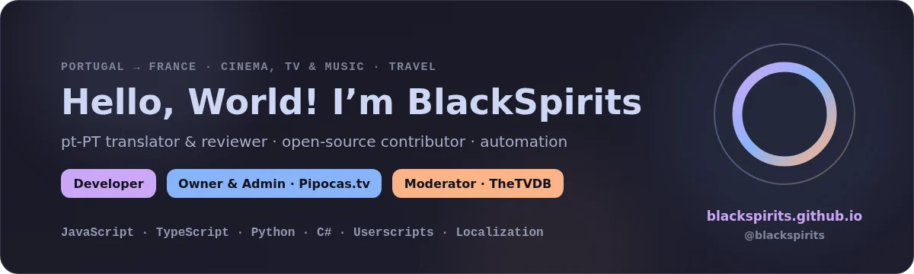
    </picture>
  </a>

<h3 align="center">Born to explore. Coded to connect. 🌍</h3>

  
  

##  About Me

 Portuguese developer, open-source contributor and technology enthusiast.  
 European Portuguese (pt-PT) translator & reviewer with contributions across **100+ software and open-source projects**.  
 Focused on automation, localization, media tooling and practical software.  
 Contributor to media, subtitles and metadata communities.  
  From Portugal ·  currently based in France.  
 Dreaming of exploring the world, one country at a time.

##  Localization & Review

I contribute to software localization and linguistic review in **European Portuguese (pt-PT)**. My approach goes beyond literal translation:

- Natural and idiomatic European Portuguese — clearly distinguished from pt-BR
- UI and functional context before literal translation
- Consistent technical terminology and software conventions
- Proofreading, linguistic QA, accessibility and user-facing clarity

  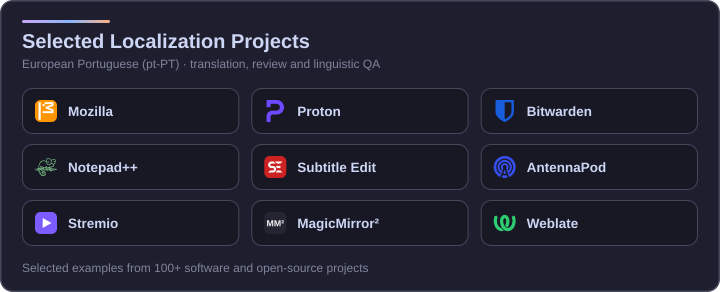

> Good localization should feel as if the product were originally written for its users — not translated for them.

  

##  Tech & Focus

  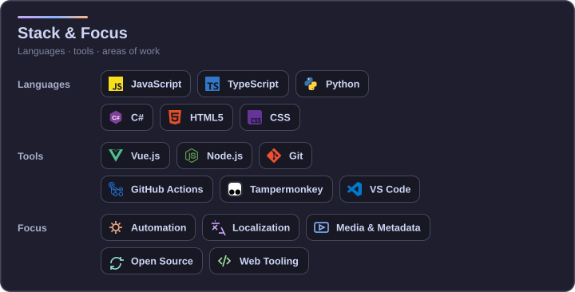

##  Selected Work

  <a href="https://github.com/BlackSpirits/UserScripts-UserStyles">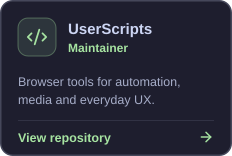</a>
  <a href="https://pipocas.tv">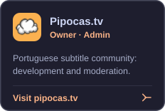</a>
  <a href="https://www.thetvdb.com">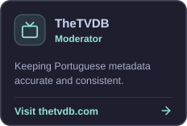</a>

##  Off the clock

  <a href="https://simkl.com/598901/dashboard/">
    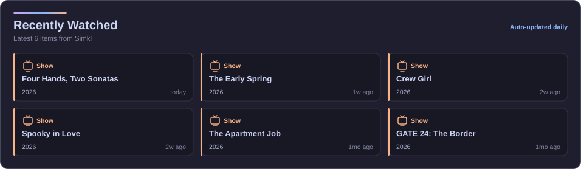
  </a>

  

  

###  Did you know?

-  I watch over **100 movies and TV series every year** — from timeless classics to fresh releases.
-  I love tweaking code for fun — the best bugs are the ones you make yourself.
-  Currently learning Korean — **한글 배우는 중!**

##  GitHub

  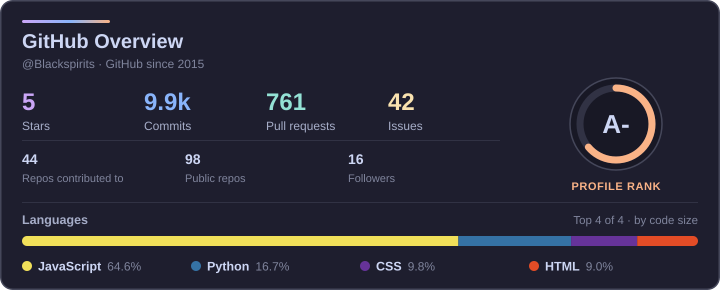

  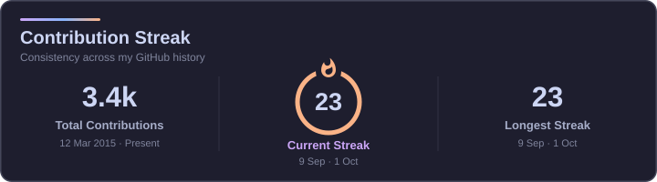

  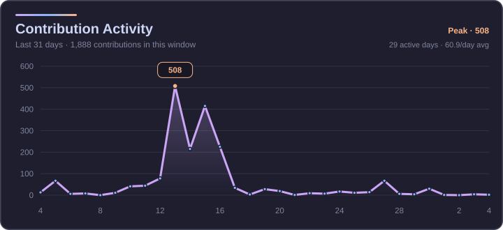

  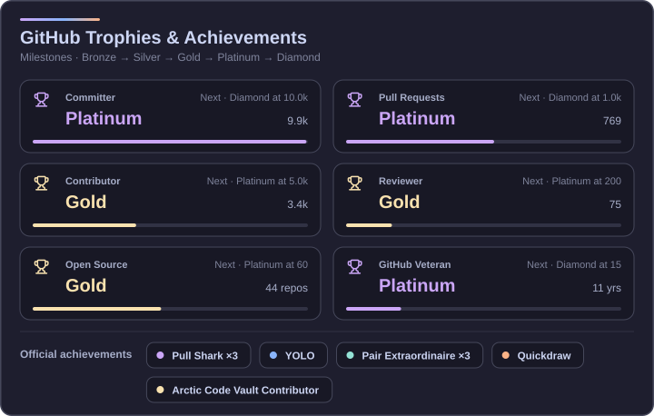

##  Support & Contact

  If you find my work useful, a coffee goes a long way ☕

  Thanks for visiting! Feel free to explore, contribute — or just say hi 👋 
  <em>Stay creative. Keep coding.</em>

<a href="#top">↑ Back to top</a>

